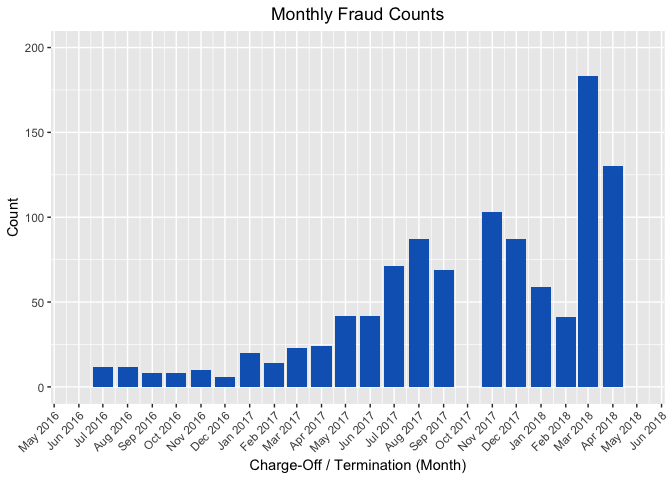
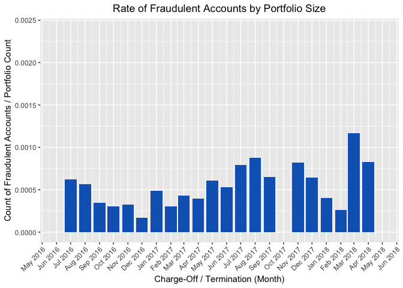
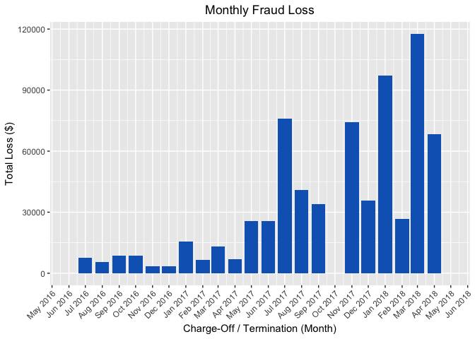
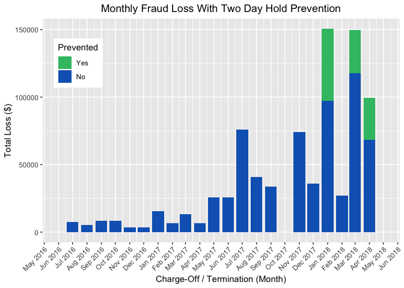
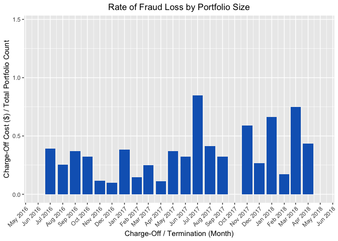
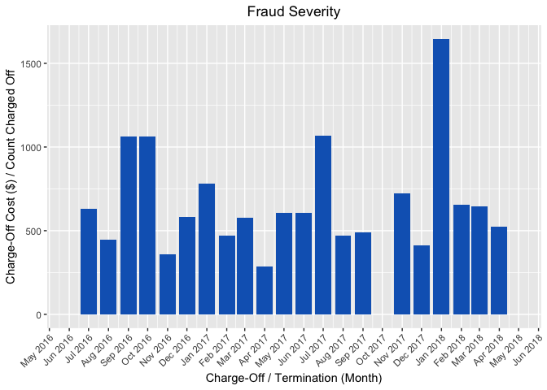

Fraud Invoices
================

``` r
####################################################################################
#
# PROJECT: FRAUD INVOICES/DECK
#
# PURPOSE: Create figures for fraud losses based off of Radius invoices
# DATE:    2018-09-05
# AUTHOR:  Eve Dexter
#
# NOTES:   - Data was aggregated from invoices sent to Aspiration from Radius containing
#            Aspiration's portion of financial responsibility of fraud/charge-off losses
#          - This differs from Aspiration's database numbers for charge-off costs or 
#            due to the fact that Aspiration is (mostly) only responsible for external
#            charge-offs (not NSF). Though there are times when Radius and Aspiration
#            have split costs for various charge-off types
#
####################################################################################


####################################################################################
# SET UP
####################################################################################

#----------#
# Packages #
#----------#

library(data.table)
library(ggplot2)
library(xtable)
library(scales)
library(gridExtra)

list.files()
```

    ## [1] "fraud-invoices.Rmd" "plots"              "R"                 
    ## [4] "Untitled_files"     "Untitled.md"        "Untitled.nb.html"  
    ## [7] "Untitled.Rmd"

``` r
#---------------#
# Query Dataset #
#---------------#
# Note: Redshift table was created via a csv 
#       combining all the monthly invoices

# Fraud invoices
df <- redshift("select * from public.ued_fraud_invoices_20180905;")
df <- data.table(df)
df[, name := NULL][ ]
```

    ##        amount       date
    ##    1:  168.20 2016-06-01
    ##    2:    4.03 2016-06-01
    ##    3:   99.99 2016-06-01
    ##    4: 1411.07 2016-06-01
    ##    5:   94.52 2016-06-01
    ##   ---                   
    ## 1462:    0.88 2018-07-01
    ## 1463:    0.77 2018-07-01
    ## 1464:    0.61 2018-07-01
    ## 1465:    0.34 2018-07-01
    ## 1466:    0.11 2018-07-01

``` r
# Portfolio counts
portfolio <- redshift("select * from public.ued_monthly_portfolio_20180904;")
portfolio <- data.table(portfolio)
portfolio
```

    ##     account_month account_count
    ##  1:    2015-06-01             2
    ##  2:    2015-07-01            14
    ##  3:    2015-10-01          3056
    ##  4:    2016-01-01          9182
    ##  5:    2016-05-01         15520
    ##  6:    2016-10-01         26547
    ##  7:    2016-12-01         35653
    ##  8:    2017-07-01         89701
    ##  9:    2017-11-01        126019
    ## 10:    2015-08-01           567
    ## 11:    2015-09-01          1770
    ## 12:    2016-03-01         12706
    ## 13:    2016-07-01         19360
    ## 14:    2016-08-01         21318
    ## 15:    2016-09-01         22948
    ## 16:    2017-03-01         53013
    ## 17:    2017-08-01         98935
    ## 18:    2017-09-01        105660
    ## 19:    2017-12-01        134714
    ## 20:    2018-03-01        157184
    ## 21:    2018-04-01        157184
    ## 22:    2018-09-01        157185
    ## 23:    2016-02-01         11027
    ## 24:    2016-11-01         30704
    ## 25:    2017-01-01         41027
    ## 26:    2017-02-01         45764
    ## 27:    2017-05-01         69238
    ## 28:    2017-06-01         79080
    ## 29:    2018-02-01        155390
    ## 30:    2018-06-01        157185
    ## 31:    2015-11-01          4851
    ## 32:    2015-12-01          6983
    ## 33:    2016-04-01         14025
    ## 34:    2016-06-01         17486
    ## 35:    2017-04-01         60349
    ## 36:    2017-10-01        116291
    ## 37:    2018-01-01        146989
    ## 38:    2018-05-01        157185
    ## 39:    2018-07-01        157185
    ## 40:    2018-08-01        157185
    ##     account_month account_count

``` r
#---------------#
# Data Cleaning #
#---------------#

# Convert date column to date object
str(df)
```

    ## Classes 'data.table' and 'data.frame':   1466 obs. of  2 variables:
    ##  $ amount: num  168.2 4.03 99.99 1411.07 94.52 ...
    ##  $ date  : chr  "2016-06-01" "2016-06-01" "2016-06-01" "2016-06-01" ...
    ##  - attr(*, ".internal.selfref")=<externalptr>

``` r
df[, date := as.Date(date)]
str(df)
```

    ## Classes 'data.table' and 'data.frame':   1466 obs. of  2 variables:
    ##  $ amount: num  168.2 4.03 99.99 1411.07 94.52 ...
    ##  $ date  : Date, format: "2016-06-01" "2016-06-01" ...
    ##  - attr(*, ".internal.selfref")=<externalptr>

``` r
# Convert date column to date object
str(portfolio)
```

    ## Classes 'data.table' and 'data.frame':   40 obs. of  2 variables:
    ##  $ account_month: chr  "2015-06-01" "2015-07-01" "2015-10-01" "2016-01-01" ...
    ##  $ account_count: num  2 14 3056 9182 15520 ...
    ##  - attr(*, ".internal.selfref")=<externalptr>

``` r
portfolio[, date := as.Date(account_month)]
str(portfolio)
```

    ## Classes 'data.table' and 'data.frame':   40 obs. of  3 variables:
    ##  $ account_month: chr  "2015-06-01" "2015-07-01" "2015-10-01" "2016-01-01" ...
    ##  $ account_count: num  2 14 3056 9182 15520 ...
    ##  $ date         : Date, format: "2015-06-01" "2015-07-01" ...
    ##  - attr(*, ".internal.selfref")=<externalptr>

``` r
# Subset to just data prior to 2018-06-01
df <- df[date < "2018-06-01"]


# Merge portfolio counts into df
merge(df, portfolio, by = "date", all.x = TRUE)
```

    ##             date  amount account_month account_count
    ##    1: 2016-06-01  168.20    2016-06-01         17486
    ##    2: 2016-06-01    4.03    2016-06-01         17486
    ##    3: 2016-06-01   99.99    2016-06-01         17486
    ##    4: 2016-06-01 1411.07    2016-06-01         17486
    ##    5: 2016-06-01   94.52    2016-06-01         17486
    ##   ---                                               
    ## 1177: 2018-05-01   21.52    2018-05-01        157185
    ## 1178: 2018-05-01   14.00    2018-05-01        157185
    ## 1179: 2018-05-01   10.00    2018-05-01        157185
    ## 1180: 2018-05-01    5.00    2018-05-01        157185
    ## 1181: 2018-05-01    0.00    2018-05-01        157185

``` r
#----------------------#
# Set Up Plot Defaults #
#----------------------#

# get min and max dates for x-axis
min_date <- min(df[, date])
min_date
```

    ## [1] "2016-06-01"

``` r
max_date <- max(df[, date])
max_date
```

    ## [1] "2018-05-01"

``` r
# get Aspiration colors
my_colors <- c("#1165bf", "#119fbf", "#37bf72", "#f2ac16", "#d94514", "#b6babf")


####################################################################################
# DATA ANALYSIS
####################################################################################

#---------#
# SUMMARY #
#---------#

# total count of fraud
df[ , .N ]
```

    ## [1] 1181

``` r
# total cost of fraud
df[ , sum( amount ) ]
```

    ## [1] 785163.3

``` r
#------------------------------#
# PLOT 1: MONTHLY FRAUD COUNTS #
#------------------------------#

# get counts by month
df1 <- df[ , .( count = .N ), by = date ]

# plot
p <- ggplot( data = df1, 
             aes( x = date, y = count) ) +
       geom_bar( stat = "identity", fill = my_colors[1] ) + 
       scale_x_date( limits = c( min_date, max_date ),
                     labels = date_format( "%b %Y" ),
                     date_breaks = "1 month" ) +
       scale_y_continuous( limits = c( 0, 200 ) ) + 
       labs( title = "Monthly Fraud Counts", 
             x = "Charge-Off / Termination (Month)",
             y = "Count" ) +
       theme( legend.position="none", 
              axis.text.x = element_text( angle = 45, hjust = 1 ),
              plot.title = element_text( hjust = 0.5 ) ) 
p
```



``` r
# save plot
ggsave( filename = "plots/01_monthly_fraud_counts.png", 
        plot = p, 
        width = 8, 
        height = 4 )


#------------------------------------------------------#
# PLOT 2: RATE OF FRADULENT ACCOUNTS BY PORTFOLIO SIZE #
#------------------------------------------------------#

# get fraud counts/portfolio counts by month
# recall: df1 <- df[, .(count = .N), by = date]
df2 <- merge( df1,
              portfolio, 
              by = "date", 
              all.x = TRUE )
              
df2[, fraud_rate := count/account_count][]
```

    ##           date count account_month account_count   fraud_rate
    ##  1: 2016-06-01    42    2016-06-01         17486 0.0024019215
    ##  2: 2016-07-01    12    2016-07-01         19360 0.0006198347
    ##  3: 2016-08-01    12    2016-08-01         21318 0.0005629046
    ##  4: 2016-09-01     8    2016-09-01         22948 0.0003486143
    ##  5: 2016-10-01     8    2016-10-01         26547 0.0003013523
    ##  6: 2016-11-01    10    2016-11-01         30704 0.0003256905
    ##  7: 2016-12-01     6    2016-12-01         35653 0.0001682888
    ##  8: 2017-01-01    20    2017-01-01         41027 0.0004874839
    ##  9: 2017-02-01    14    2017-02-01         45764 0.0003059173
    ## 10: 2017-03-01    23    2017-03-01         53013 0.0004338558
    ## 11: 2017-04-01    24    2017-04-01         60349 0.0003976868
    ## 12: 2017-05-01    42    2017-05-01         69238 0.0006066033
    ## 13: 2017-06-01    42    2017-06-01         79080 0.0005311077
    ## 14: 2017-07-01    71    2017-07-01         89701 0.0007915185
    ## 15: 2017-08-01    87    2017-08-01         98935 0.0008793652
    ## 16: 2017-09-01    69    2017-09-01        105660 0.0006530380
    ## 17: 2017-11-01   103    2017-11-01        126019 0.0008173371
    ## 18: 2017-12-01    87    2017-12-01        134714 0.0006458126
    ## 19: 2018-01-01    59    2018-01-01        146989 0.0004013906
    ## 20: 2018-02-01    41    2018-02-01        155390 0.0002638522
    ## 21: 2018-03-01   183    2018-03-01        157184 0.0011642406
    ## 22: 2018-04-01   130    2018-04-01        157184 0.0008270562
    ## 23: 2018-05-01    88    2018-05-01        157185 0.0005598499
    ##           date count account_month account_count   fraud_rate

``` r
# plot
p <- ggplot( data = df2, 
             aes( x = date, y = fraud_rate ) ) +
       geom_bar( stat = "identity", fill = my_colors[1] ) + 
       scale_x_date( limits = c( min_date, max_date ), 
                     labels = date_format( "%b %Y" ), 
                     date_breaks = "1 month" ) +
       labs( title = "Rate of Fraudulent Accounts by Portfolio Size", 
             x = "Charge-Off / Termination (Month)",
             y = "Count of Fraudulent Accounts / Portfolio Count" ) +
       theme( legend.position="none", 
              axis.text.x = element_text( angle = 45, hjust = 1 ),
              plot.title = element_text( hjust = 0.5 ) ) 
p
```



``` r
# save plot
ggsave( filename = "plots/02_rate_of_fraud_accounts_by_portfolio.png", 
        plot = p, 
        width = 8, 
        height = 4 )


#----------------------------#
# PLOT 3: MONTHLY FRAUD LOSS #
#----------------------------#

# get cost by month
df3 <- df[ , .( amount = sum( amount ) ), by = date ]

# plot
p <- ggplot( data = df3, 
             aes( x = date, y = amount ) ) +
       geom_bar( stat = "identity", 
                 fill = my_colors[ 1 ] ) + 
       scale_x_date( limits = c( min_date, max_date ),
                     labels = date_format( "%b %Y" ),
                     date_breaks = "1 month") +
       labs( title = "Monthly Fraud Loss", 
             x = "Charge-Off / Termination (Month)",
             y = "Total Loss ($)" ) +
       theme( legend.position="none", 
              axis.text.x = element_text( angle = 45, hjust = 1 ),
              plot.title = element_text( hjust = 0.5 ) ) 
p
```



``` r
# save plot
ggsave( filename = "plots/03_monthly_fraud_loss.png", 
        plot = p, 
        width = 8, 
        height = 4 )


#-----------------------------------------------#
# PLOT 3B: MONTHLY FRAUD LOSS PROJECTED SAVINGS #
#-----------------------------------------------#

# Using 2018 data provided by Ops team
prevention <- data.table(
                data.frame( "date" = as.Date( c( "2018-01-01", "2018-02-01", "2018-03-01", 
                                                "2018-04-01", "2018-05-01" )),
                            "fraud_loss" = c( 97214.00, 26838.25, 117788.00, 68239.00, 58441.00 ),
                            "prevented_loss" = c( 53582.00, 0.00, 31957.00, 31376.00, 18046.00)))

# merge savings with df
prevention2 <- merge( df[ , .( total_amount = sum( amount ) ), by = date ], 
                      prevention,
                      by = "date", 
                      all.x = TRUE )

# clean data
prevention2[ is.na( prevented_loss ), prevented_loss := 0][ ]
```

    ##           date total_amount fraud_loss prevented_loss
    ##  1: 2016-06-01     25554.21         NA              0
    ##  2: 2016-07-01      7585.60         NA              0
    ##  3: 2016-08-01      5372.04         NA              0
    ##  4: 2016-09-01      8517.03         NA              0
    ##  5: 2016-10-01      8517.03         NA              0
    ##  6: 2016-11-01      3564.03         NA              0
    ##  7: 2016-12-01      3490.00         NA              0
    ##  8: 2017-01-01     15669.04         NA              0
    ##  9: 2017-02-01      6589.16         NA              0
    ## 10: 2017-03-01     13244.52         NA              0
    ## 11: 2017-04-01      6833.47         NA              0
    ## 12: 2017-05-01     25554.21         NA              0
    ## 13: 2017-06-01     25554.21         NA              0
    ## 14: 2017-07-01     75893.74         NA              0
    ## 15: 2017-08-01     40799.04         NA              0
    ## 16: 2017-09-01     33930.87         NA              0
    ## 17: 2017-11-01     74240.86         NA              0
    ## 18: 2017-12-01     35734.13         NA              0
    ## 19: 2018-01-01     97213.82   97214.00          53582
    ## 20: 2018-02-01     26838.25   26838.25              0
    ## 21: 2018-03-01    117787.55  117788.00          31957
    ## 22: 2018-04-01     68239.04   68239.00          31376
    ## 23: 2018-05-01     58441.47   58441.00          18046
    ##           date total_amount fraud_loss prevented_loss

``` r
prevention2[ , fraud_loss := ifelse( is.na( fraud_loss ), total_amount, fraud_loss ) ][ ]
```

    ##           date total_amount fraud_loss prevented_loss
    ##  1: 2016-06-01     25554.21   25554.21              0
    ##  2: 2016-07-01      7585.60    7585.60              0
    ##  3: 2016-08-01      5372.04    5372.04              0
    ##  4: 2016-09-01      8517.03    8517.03              0
    ##  5: 2016-10-01      8517.03    8517.03              0
    ##  6: 2016-11-01      3564.03    3564.03              0
    ##  7: 2016-12-01      3490.00    3490.00              0
    ##  8: 2017-01-01     15669.04   15669.04              0
    ##  9: 2017-02-01      6589.16    6589.16              0
    ## 10: 2017-03-01     13244.52   13244.52              0
    ## 11: 2017-04-01      6833.47    6833.47              0
    ## 12: 2017-05-01     25554.21   25554.21              0
    ## 13: 2017-06-01     25554.21   25554.21              0
    ## 14: 2017-07-01     75893.74   75893.74              0
    ## 15: 2017-08-01     40799.04   40799.04              0
    ## 16: 2017-09-01     33930.87   33930.87              0
    ## 17: 2017-11-01     74240.86   74240.86              0
    ## 18: 2017-12-01     35734.13   35734.13              0
    ## 19: 2018-01-01     97213.82   97214.00          53582
    ## 20: 2018-02-01     26838.25   26838.25              0
    ## 21: 2018-03-01    117787.55  117788.00          31957
    ## 22: 2018-04-01     68239.04   68239.00          31376
    ## 23: 2018-05-01     58441.47   58441.00          18046
    ##           date total_amount fraud_loss prevented_loss

``` r
# convert to long form
prevention3 <- melt(prevention2, measure.vars = c("fraud_loss", "prevented_loss"),
               variable.name = "prevented_loss", value.name = "amount")

# relevel prevented column for betting graphing
prevention3[ , Prevented  := factor( prevented_loss, 
                                     levels = c( "prevented_loss", "fraud_loss" ), 
                                     labels = c( "Yes", "No" ) ) ]


p <- ggplot( data = prevention3, 
             aes( x = date, y = amount, fill = Prevented ) ) +
       geom_bar( stat = "identity" ) + 
       scale_fill_manual( values = my_colors[ c( 3, 1 ) ] ) +
       scale_x_date( limits = c( min_date, max_date ),
                     labels = date_format( "%b %Y" ),
                     date_breaks = "1 month" ) +
       labs( title = "Monthly Fraud Loss With Two Day Hold Prevention", 
             x = "Charge-Off / Termination (Month)",
             y = "Total Loss ($)" ) +
       theme( legend.position=c( .1, .8 ), 
              axis.text.x = element_text( angle = 45, hjust = 1 ),
              plot.title = element_text( hjust = 0.5 ) ) 
p
```



``` r
# save plot
ggsave( filename = "plots/03B_monthly_fraud_loss_with_prevented.png", 
        plot = p, 
        width = 8, 
        height = 4 )


#----------------------------------------------#
# PLOT 4: RATE OF FRAUD LOSS BY PORTFOLIO SIZE #
#----------------------------------------------#

# get fraud cost/portfolio counts by month
# recall: df3 <- df[, .(amount = sum(amount)), by = date]
df4 <- merge( df3, 
              portfolio, 
              by = "date", 
              all.x = TRUE )
df4[ , loss_rate := amount / account_count ][ ]
```

    ##           date    amount account_month account_count  loss_rate
    ##  1: 2016-06-01  25554.21    2016-06-01         17486 1.46140970
    ##  2: 2016-07-01   7585.60    2016-07-01         19360 0.39181818
    ##  3: 2016-08-01   5372.04    2016-08-01         21318 0.25199550
    ##  4: 2016-09-01   8517.03    2016-09-01         22948 0.37114476
    ##  5: 2016-10-01   8517.03    2016-10-01         26547 0.32082834
    ##  6: 2016-11-01   3564.03    2016-11-01         30704 0.11607706
    ##  7: 2016-12-01   3490.00    2016-12-01         35653 0.09788798
    ##  8: 2017-01-01  15669.04    2017-01-01         41027 0.38192020
    ##  9: 2017-02-01   6589.16    2017-02-01         45764 0.14398130
    ## 10: 2017-03-01  13244.52    2017-03-01         53013 0.24983532
    ## 11: 2017-04-01   6833.47    2017-04-01         60349 0.11323253
    ## 12: 2017-05-01  25554.21    2017-05-01         69238 0.36907782
    ## 13: 2017-06-01  25554.21    2017-06-01         79080 0.32314378
    ## 14: 2017-07-01  75893.74    2017-07-01         89701 0.84607463
    ## 15: 2017-08-01  40799.04    2017-08-01         98935 0.41238227
    ## 16: 2017-09-01  33930.87    2017-09-01        105660 0.32113260
    ## 17: 2017-11-01  74240.86    2017-11-01        126019 0.58912434
    ## 18: 2017-12-01  35734.13    2017-12-01        134714 0.26525922
    ## 19: 2018-01-01  97213.82    2018-01-01        146989 0.66136799
    ## 20: 2018-02-01  26838.25    2018-02-01        155390 0.17271543
    ## 21: 2018-03-01 117787.55    2018-03-01        157184 0.74936094
    ## 22: 2018-04-01  68239.04    2018-04-01        157184 0.43413477
    ## 23: 2018-05-01  58441.47    2018-05-01        157185 0.37180055
    ##           date    amount account_month account_count  loss_rate

``` r
# mean fraud loss per portfolio account
df4[ , mean( loss_rate ) ]
```

    ## [1] 0.4093785

``` r
# plot
p <- ggplot( data = df4, 
             aes( x = date, y = loss_rate ) ) +
       geom_bar( stat = "identity", 
                 fill = my_colors[ 1 ] ) + 
       scale_x_date( limits = c( min_date, max_date ),
                     labels = date_format( "%b %Y" ),
                     date_breaks = "1 month" ) +
       labs( title = "Rate of Fraud Loss by Portfolio Size", 
             y = "Charge-Off Cost ($) / Total Portfolio Count", 
             x = "Charge-Off / Termination (Month)" ) +
       theme( legend.position="none", 
              axis.text.x = element_text( angle = 45, hjust = 1 ),
              plot.title = element_text( hjust = 0.5 ) ) 
p
```



``` r
# save plot
ggsave( filename = "plots/04_rate_of_fraud_loss_by_portfolio.png", 
        plot = p, 
        width = 8, 
        height = 4 )


#------------------------#
# PLOT 5: FRAUD SEVERITY #
#------------------------#
# Note: Severity = (fraud $) / (# fraud accounts)

# get fraud severity by month
df5 <- df[ , .( amount = sum( amount ), count = .N ), by = date ]
df5[ , loss_rate := amount / count ][ ]
```

    ##           date    amount count loss_rate
    ##  1: 2016-06-01  25554.21    42  608.4336
    ##  2: 2016-07-01   7585.60    12  632.1333
    ##  3: 2016-08-01   5372.04    12  447.6700
    ##  4: 2016-09-01   8517.03     8 1064.6288
    ##  5: 2016-10-01   8517.03     8 1064.6288
    ##  6: 2016-11-01   3564.03    10  356.4030
    ##  7: 2016-12-01   3490.00     6  581.6667
    ##  8: 2017-01-01  15669.04    20  783.4520
    ##  9: 2017-02-01   6589.16    14  470.6543
    ## 10: 2017-03-01  13244.52    23  575.8487
    ## 11: 2017-04-01   6833.47    24  284.7279
    ## 12: 2017-05-01  25554.21    42  608.4336
    ## 13: 2017-06-01  25554.21    42  608.4336
    ## 14: 2017-07-01  75893.74    71 1068.9259
    ## 15: 2017-08-01  40799.04    87  468.9545
    ## 16: 2017-09-01  33930.87    69  491.7517
    ## 17: 2017-11-01  74240.86   103  720.7850
    ## 18: 2017-12-01  35734.13    87  410.7371
    ## 19: 2018-01-01  97213.82    59 1647.6919
    ## 20: 2018-02-01  26838.25    41  654.5915
    ## 21: 2018-03-01 117787.55   183  643.6478
    ## 22: 2018-04-01  68239.04   130  524.9157
    ## 23: 2018-05-01  58441.47    88  664.1076
    ##           date    amount count loss_rate

``` r
# average loss rate
df5[ , mean( loss_rate ) ]
```

    ## [1] 668.8358

``` r
# average loss rate without outliers
ol <- boxplot( df[ , amount ], plot = FALSE)$out
df[ , outlier := ifelse( amount %in% ol, 1, 0 ) ]
df[ outlier == 0, .( amount = sum( amount ), count = .N ), by = date ][ , 
    .( loss_rate = amount / count ) ][ , mean( loss_rate ) ]
```

    ## [1] 284.622

``` r
# plot
p <- ggplot( data = df5, 
             aes( x = date, y = loss_rate ) ) +
       geom_bar( stat = "identity", 
                 fill = my_colors[ 1 ] ) + 
       scale_x_date( limits = c( min_date, max_date ),
                     labels = date_format( "%b %Y" ),
                     date_breaks = "1 month" ) +
       labs( title = "Fraud Severity", 
             x = "Charge-Off / Termination (Month)",
             y = "Charge-Off Cost ($) / Count Charged Off" ) +
       theme( legend.position="none", 
              axis.text.x = element_text( angle = 45, hjust = 1 ),
              plot.title = element_text( hjust = 0.5 ) ) 
p
```



``` r
# save plot
ggsave( filename = "plots/05_fraud_severity.png", 
        plot = p, 
        width = 8, 
        height = 4)
list.files( "plots" )
```

    ## [1] "01_monthly_fraud_counts.png"               
    ## [2] "02_rate_of_fraud_accounts_by_portfolio.png"
    ## [3] "03_monthly_fraud_loss.png"                 
    ## [4] "03B_monthly_fraud_loss_with_prevented.png" 
    ## [5] "04_rate_of_fraud_loss_by_portfolio.png"    
    ## [6] "05_fraud_severity.png"
